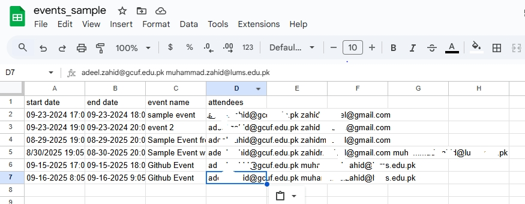
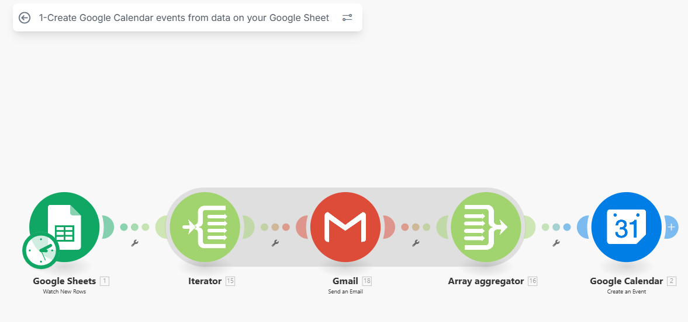
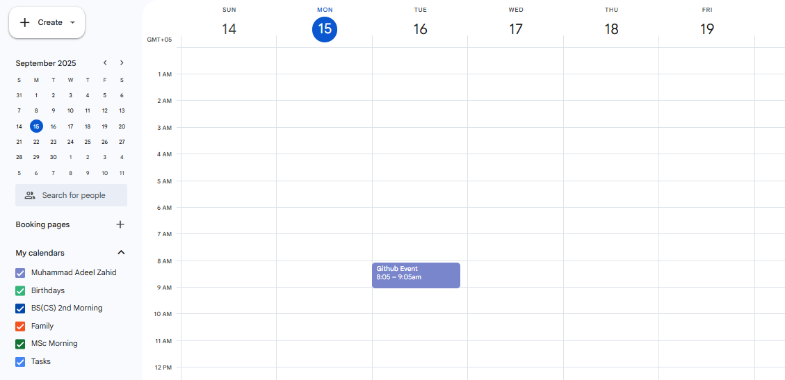
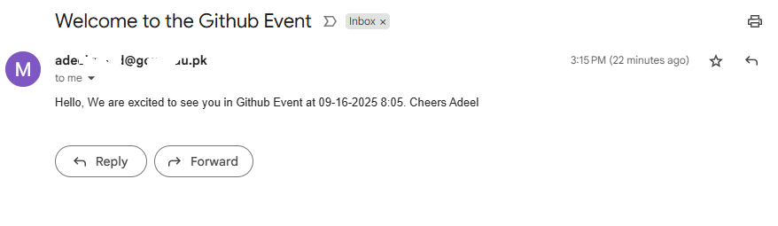

# 1 — Create Google Calendar events from data on your Google Sheet

Summary
- Watches rows in a Google Sheet and creates Google Calendar events for each row.
- Supports multiple attendees (space-separated email list in the attendees column).
- Blueprint file: `1-Create Google Calendar events from data on your Google Sheet.blueprint.json`

Sanitization / placeholders
Replace these placeholders in the blueprint before importing:
- <SPREADSHEET_ID> — your Google Sheet ID/file
- <SHEET_NAME> — sheet/tab name (e.g., "Sheet1")
- <GOOGLE_CONN_ID> — Make connection id for the Google account used for Calendar/Sheets
- <GOOGLE_RESTRICTED_ACCOUNT_ID> — Make connection id used for sending emails (restricted)
- <YOUR_EMAIL> — calendar ID / primary email
- <YOUR_NAME> — sender display name in email templates

Sheet column mapping (headers expected in the blueprint)
- Column A (start date) — Start date/time
- Column B (end date) — End date/time
- Column C (event name) — Event summary
- Column D (attendees) — Space-separated emails (e.g., "a@example.com b@example.com")
- Columns E–Z — optional, used for description or other fields in the blueprint

How to use
1. Update the blueprint JSON placeholders with your IDs and connection names.
2. In Make (make.com):
   - Import the blueprint JSON as a new scenario.
   - Authorize/attach the referenced Google connections (google, google-restricted).
   - Ensure the sheet has headers and the header row range matches the blueprint (A1:Z1).
3. Run a test by adding a sample row to the watched sheet and execute the scenario.

Testing tips
- Use a test calendar and test email addresses you control.
- Start with limit = 1 and feeder values small to validate behavior before scaling.

Privacy
- This blueprint in the repo is sanitized. Never commit live credentials, tokens, or private user data.

Walkthrough: Create events from a sheet (visual guide)

Below is a short, hands-on walkthrough that shows the typical flow when using this blueprint. Each step uses the screenshots included in this repo (in `docs/images`). The images are referenced relative to this document so they render on GitHub.

### 1) Prepare your Google Sheet

Start with a simple sheet that has headers and one or more rows of event data. At minimum the blueprint expects Start, End, Summary, and Attendees columns.

What to check:
- Make sure the header row is correct and the blueprint's header range (A1:Z1) matches.
- Use ISO-style datetimes or a consistent format your calendar understands (or adjust the blueprint mapping).
- For multiple attendees, separate emails with spaces (e.g., "alice@example.com bob@example.com").

Quick tip: Add a single test row first so you can validate behavior without creating many events.

---

### 2) Import the blueprint and inspect the scenario diagram

Import the JSON blueprint into Make (make.com) as a new scenario. Before turning it on, open the scenario canvas and inspect the module diagram to understand the flow: the trigger reads new rows, the parser normalizes attendees, the Calendar module creates events, and an optional mail/send module notifies participants.

What to check on the diagram:
- Connections: attach your Google Sheets and Google Calendar connections to the appropriate modules.
- Error handlers and limits: look for any filters or limits the blueprint sets (use small limits for testing).

---

### 3) Run a test and verify events in your calendar

After authorizing connections, either add a row to the watched sheet or run the scenario manually (depending on trigger configuration). Then check the target calendar to confirm the event was created with the expected time, title, and attendees.

What to check in the calendar:
- Event time zone and start/end times.
- Attendees are listed and (optionally) have received invitations.

---

### 4) Confirm email notifications (if enabled)

If the blueprint sends emails (e.g., a restricted-send step), verify that the sender, subject, and body match what you expect and that test recipients receive the message.

Mini checklist before enabling production runs:
- Replace placeholders in the blueprint (`<SPREADSHEET_ID>`, `<SHEET_NAME>`, `<GOOGLE_CONN_ID>`, etc.).
- Use a test calendar and test email addresses.
- Start with a low limit (for example: 1 row) to validate behavior.
- Review error handling and add logging or notifications for failures.